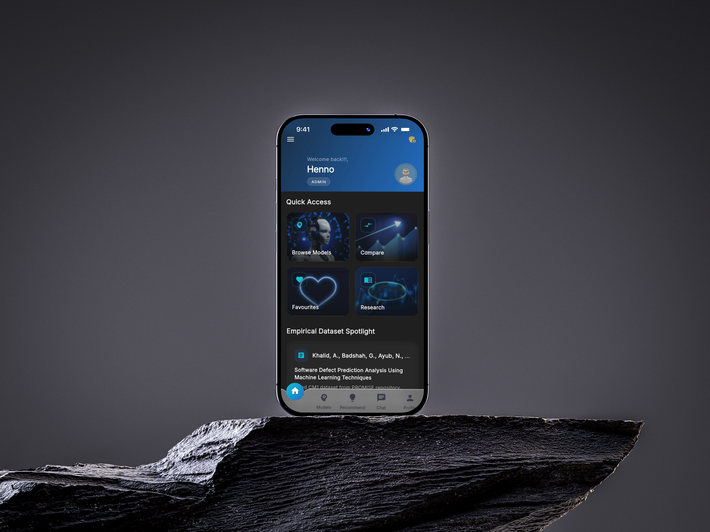
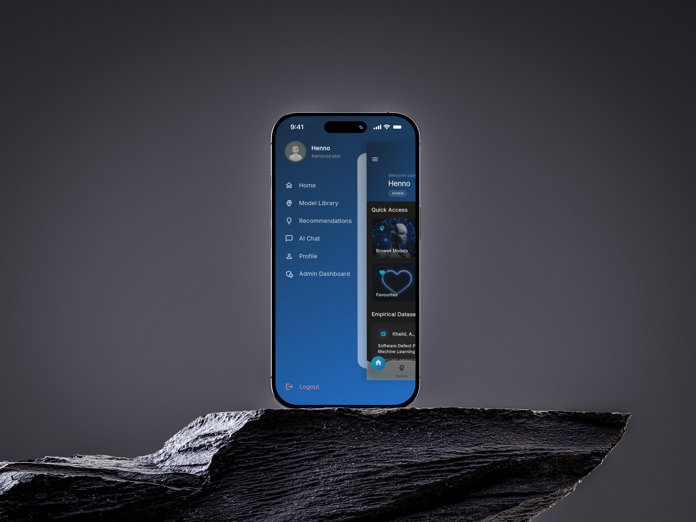
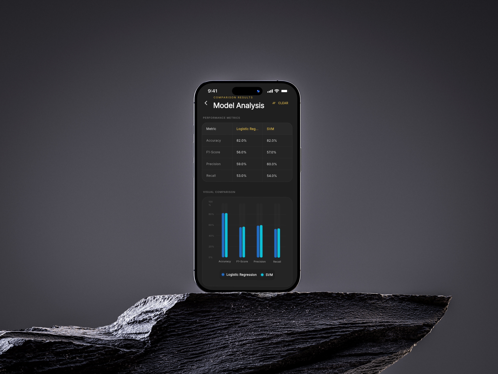
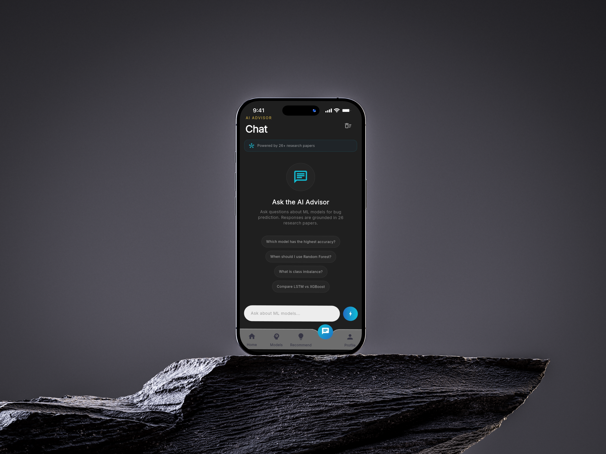
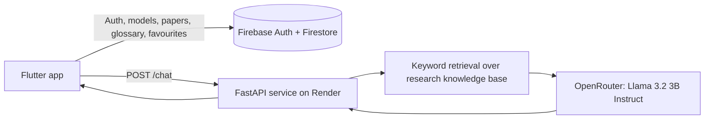

# ML Advisor

A mobile app that helps software engineering students and developers choose a machine-learning model for **software bug prediction**. It combines a model library, side-by-side comparison, a guided recommendation wizard and an AI chat grounded in published research.

Capstone project · **API:** <https://ml-advisor-api.onrender.com>

> **Team project.** Built by a team of four. See [Team](#team) for who did what.

## Screenshots: 






## Features

- Email and Google sign-in (Firebase Authentication) with user roles: student, developer and admin.
- **Model library and detail pages** with performance information drawn from published research.
- **Comparison view** with bar charts (fl_chart).
- **Recommendation wizard:** four questions (dataset size, dataset type, priority, class imbalance) feed a weighted scoring routine that ranks models.
- Favourites, research papers and a glossary.
- **AI chat:** a FastAPI endpoint matches your question against a curated knowledge base of research summaries and passes the best matches to an LLM.
- **Admin dashboard:** create, update and delete models, papers, glossary terms and users, with usage analytics.

## Architecture



The retrieval step is keyword-based: it selects relevant research summaries from `backend/knowledge_base/` and adds them to the prompt. It does not use embeddings or a vector database. The knowledge base was built from 26 peer-reviewed papers.

## Tech stack

| Area | Technology |
|---|---|
| Mobile app | Flutter, Dart, Provider, fl_chart |
| Auth and data | Firebase Authentication, Cloud Firestore |
| Backend | Python, FastAPI, httpx, python-dotenv |
| LLM | Llama 3.2 3B Instruct via OpenRouter |
| Hosting | Render (API) |

## Repository layout

```text
backend/
  main.py                  FastAPI app with the /chat endpoint
  knowledge_base/          Research summaries and retrieval logic
  requirements.txt
mobile/ml_advisor_app/     Flutter app (lib/screens, providers, services, models)
```

## Getting started

**Prerequisites:** Flutter SDK (Dart >=3.0 <4.0), Python 3.10+, an [OpenRouter](https://openrouter.ai) API key, a Firebase project.

### 1. Backend

```bash
cd backend
python -m venv .venv
source .venv/bin/activate        # Windows: .venv\Scripts\activate
pip install -r requirements.txt
echo "OPENROUTER_API_KEY=<your-key>" > .env
uvicorn main:app --reload --port 8000
```

Run it from the `backend/` folder so the `knowledge_base` package is found.

### 2. Mobile app

```bash
cd mobile/ml_advisor_app
flutter pub get
```

By default the app calls the hosted API. To use your local backend, edit `lib/utils/constants.dart`:

- Android emulator: `http://10.0.2.2:8000`
- iOS simulator: `http://localhost:8000`
- Physical device: your computer's LAN address, port 8000

Then run:

```bash
flutter run
```

### 3. Firebase

The repository contains the Firebase client configuration for the original project. To use your own project, run `flutterfire configure`, enable Email/Password and Google sign-in, and create the Firestore collections the app reads: `models`, `papers`, `glossary`, `favorites`, `users` and `analytics_history`.

> Seed data for these collections is not included in this repository yet.
<!-- TODO: add your local seed file as e.g. tools/seed_firestore.* (remove any private data first), then replace the note above with run instructions. -->

### 4. Build an Android APK

```bash
cd mobile/ml_advisor_app
flutter build apk --release
```

The APK is written to `build/app/outputs/flutter-apk/app-release.apk`. The release build currently uses the debug signing key (`android/app/build.gradle.kts`), which is fine for sideloading and demos but not for the Play Store. A published APK is not available yet.
<!-- TODO: build the APK, attach it to a GitHub Release, then link it here. -->

## Testing

The Flutter project still has the default template widget test. Automated tests for the recommendation logic and the chat endpoint are planned.

## Roadmap

- Authentication and rate limiting for `/chat`; stop returning raw error text to clients
- Move the recommendation weights into configuration or Firestore
- Seed script and Firestore security rules in the repository
- Unit tests for the scoring routine and the knowledge-base retriever
- Embedding-based retrieval

## Team

| Member | Contribution |
|---|---|
| **Shine Chikwapulo** | Team lead; backend, knowledge base and AI chat; most of the Flutter implementation (per commit history); set up the Git workflow |
| **Henno** | Frontend |
| **Jayden** | Documentation |
| **Dube** | Documentation |

<!-- CONFIRM: full names / GitHub handles, and whether "most of the Flutter implementation" is how you want it stated (commits show about 95% of added lines under your two git identities). -->

## Author

Shine Chikwapulo · [GitHub](https://github.com/ShyneChikwapulo) · [LinkedIn](https://www.linkedin.com/in/shine-chikwapulo-741b20265/)